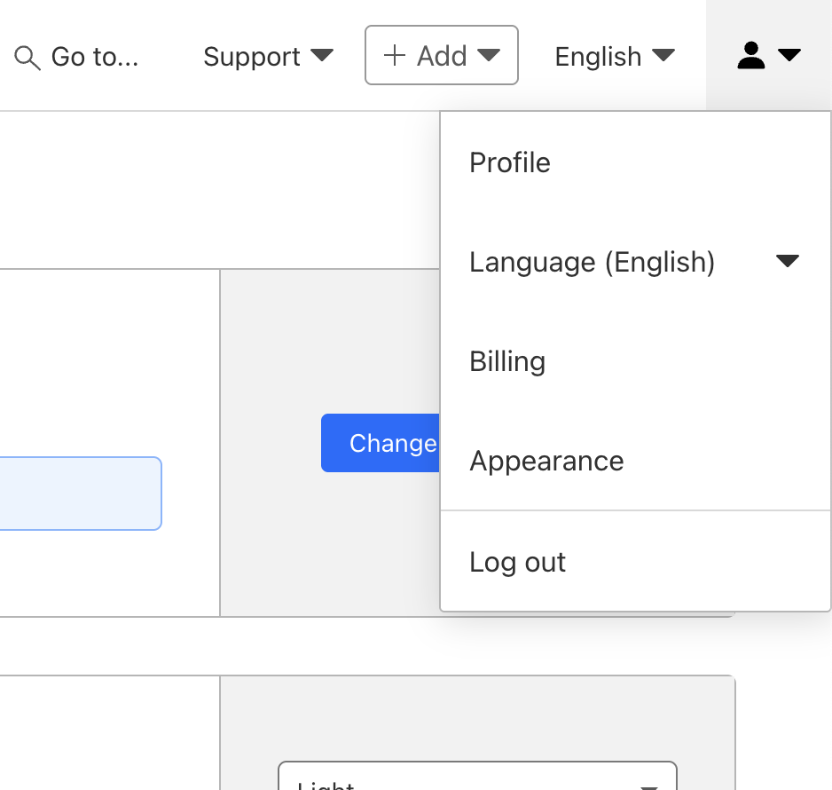

# Cloudflare

## Account

### Configuration

Manage Account > Configuration

### Validate Email

User Menu > Profile > Preferences

 

### Create a Zero Trust organization

On your Account Home in the Cloudflare dashboard, select the Zero Trust icon.

On the onboarding screen, choose a team name. The team name is a unique, internal identifier for your Zero Trust organization. Users will enter this team name when they enroll their device manually, and it will be the subdomain for your App Launcher (as relevant). Your business name is the typical entry.

Complete your onboarding by selecting a subscription plan and entering your payment details. If you chose the Zero Trust Free plan, this step is still needed but you will not be charged.

### Find account ID (Workers and Pages)

You can also find your account ID within the Workers & Pages section of your account:

Log in to the Cloudflare dashboard ↗.

Select your account.

Go to Workers & Pages.

The Account details section contains your Account ID. To copy these values for API commands or other tasks, select Click to copy.

### Create API Token

User Menu > Profile > API Tokens > Create Token > Create Custom Token

#### Permissions

Type	| Name	| Policy | Comment
|--------|------|------|----------------------|
Account	| Account Settings	| Read | Get Account ID
Account | Access: Organizations, Identity Providers, and Groups | Edit |	Zero Trust Access Group
Account | Access: Apps and Policies | Edit | Access Profile 
Account | Zero Trust | Edit | Setting (WARP Client)
Account	| Cloudflare Tunnel	| Edit | Cloudflare Tunnel
Zone | Zone | Edit | Create Zone
Zone | Zone Settings | Edit | SSL/TSL
Zone | DNS | Edit | DNS Records

#### Account Resources

Include | All Accounts

#### Zone Resources

Include | All Zones

#### API Token Secret

Save API Token to secure location (i.e. HCP Vault)

## Setup 

### Terraform

```bash
$ make cloudflare
...
Outputs:

result = {
  "account_id" = "88fc44f05f0a441a00f04e38dc7bd90b"
  "zone_id" = "32a44d0ed7ef47903a57f94f6e4f0542"
  "zone_nameservers" = tolist([
    "donovan.ns.cloudflare.com",
    "evangeline.ns.cloudflare.com",
  ])
}
```

### Nameservers

Update zone domain nameservers with you domain registrar as specified in the result (`zone_nameservers`)